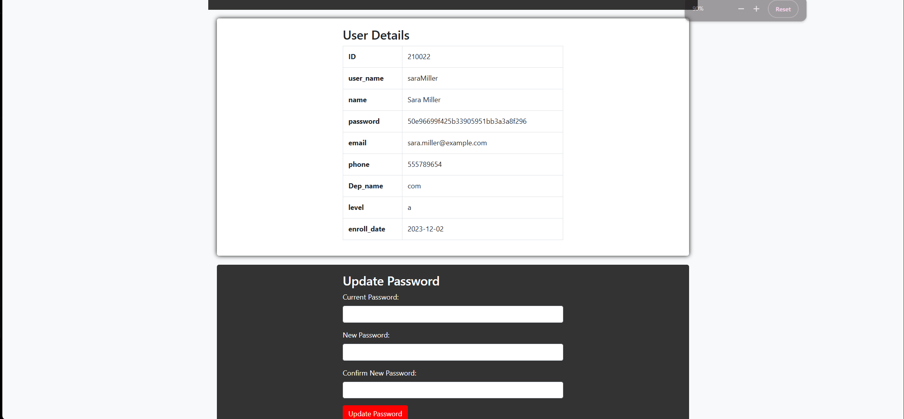
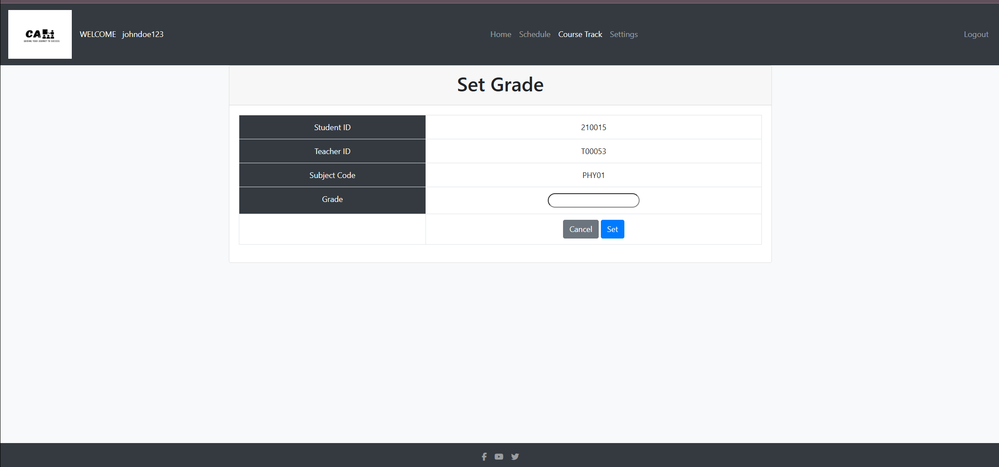
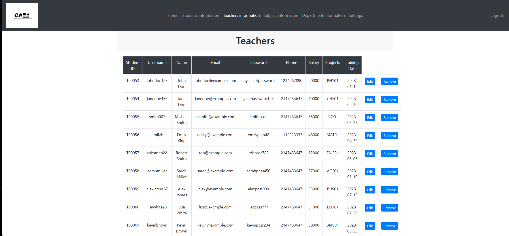
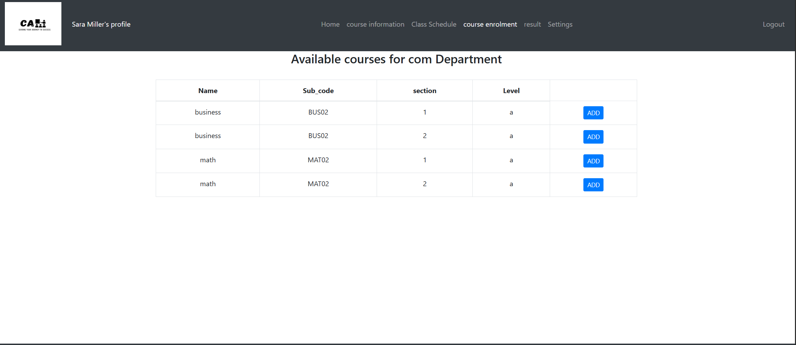

# 🏫 Crusaders Coaching Academy  
**PHP & MySQL Coaching Management System**

Crusaders Coaching Academy is a **web-based coaching institute management system** built using **PHP and MySQL**, designed to manage **students, teachers, courses, departments, schedules, and academic records**.

The system provides **role-based access** for **Admin, Teacher, and Student**, enabling efficient academic administration and streamlined communication within the institute.


## 📸 Screenshots

<div align="left">
  
  
  
  
</div>


---

## 🎯 Project Overview
- Centralized coaching institute management
- Role-based dashboards (Admin / Teacher / Student)
- Course enrollment & tracking
- Teacher and student management
- Academic scheduling and grading

---

## 🧱 Tech Stack

| Layer | Technology |
|------|------------|
| Frontend | HTML |
| Backend | PHP |
| Database | MySQL |
| Server | Apache (XAMPP) |
| DB Tool | phpMyAdmin |

---

## ✨ Core Features

### 👤 User Roles
- **Admin**
  - Manage teachers, students, departments, and subjects
  - Assign courses and schedules
  - View institute-wide data
- **Teacher**
  - View assigned courses
  - Manage student grades
  - Access schedules
- **Student**
  - Course enrollment
  - View schedules and results
  - Track academic progress

---

### 📚 Academic Management
- Course and subject management
- Department and grade handling
- Student enrollment and course tracking
- Result and performance viewing

---

### 🗓️ Scheduling System
- Class schedules
- Student and teacher timetable views
- Course-based tracking

---

### 🔐 Authentication
- Login and registration system
- Role-based page access
- Secure database-backed authentication

---

## 🗂️ Project Structure

```plaintext
Crusaders-Coaching-Academy/
├── Crusaders Coaching Academy/      # Main PHP application
│   ├── *.php                        # Pages & backend logic
│   ├── connect.php                 # Database connection
│   ├── database_code.sql           # Database schema
│   ├── *.jpg                        # UI images & assets
├── screenshots/                     # Project screenshots
└── README.md
